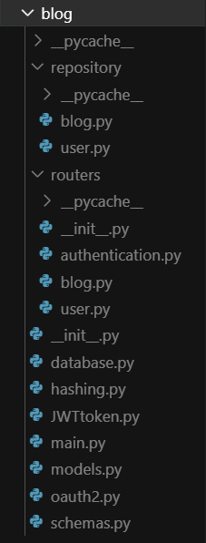
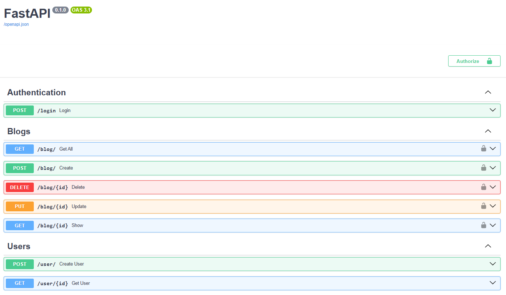

# FastAPI Backend Course Project

This repository contains the complete code for the [FastAPI - A Python Framework | Full Course](https://www.youtube.com/watch?v=7t2alSnE2-I&t=373s) tutorial on YouTube. The project demonstrates how to build a robust backend API using FastAPI, covering everything from basic setup to authentication, database integration, and deployment.

## 📚 About the Project

This project is a hands-on implementation of a blog API using FastAPI. It covers essential backend development concepts such as routing, request/response handling, database models, authentication with JWT, and more. The codebase is structured for clarity and scalability, making it a great reference for both beginners and intermediate Python backend developers.

## 🎥 Tutorial Reference

- **YouTube Video:** [FastAPI - A Python Framework | Full Course](https://www.youtube.com/watch?v=7t2alSnE2-I&t=373s)
- **Channel:** Bitfumes

## 🗂️ Codebase Structure


<!-- Upload your screenshot as 'blog_structure.png' in the repo root or update the path accordingly -->

### How the Codebase Works

This project follows a modular and scalable structure, making it easy to maintain and extend. Here’s how the main components interact:

- **main.py**  
  The entry point of the application. It creates the FastAPI app instance and includes routers for different parts of the API (such as blogs and users).

- **routers/**  
  Contains route definitions for different resources.  
  - `routers/blog.py`: Defines the API endpoints for blog operations (CRUD).  
  - `routers/user.py`: Defines the API endpoints for user operations.  
  - `routers/authentication.py`: Handles authentication-related endpoints (e.g., login).

- **repository/**  
  Contains the business logic and database operations.  
  - `repository/blog.py`: Implements the core logic for blog-related actions (e.g., create, read, update, delete blogs).  
  - `repository/user.py`: Implements the logic for user-related actions.

- **models.py**  
  Defines the SQLAlchemy models for the database tables.

- **schemas.py**  
  Contains Pydantic models for request and response validation.

- **database.py**  
  Sets up the database connection and session.

- **hashing.py**  
  Handles password hashing and verification.

- **JWTtoken.py**  
  Manages JWT creation for authentication.

- **oauth2.py**  
  Handles OAuth2 authentication logic.

This separation of concerns ensures that:
- **Routes** (in `routers/`) only handle HTTP request/response and delegate business logic.
- **Business logic** (in `repository/`) is reusable and testable.
- **Models** and **schemas** keep data validation and database structure organized.

**Example flow:**  
A request to a blog endpoint is routed from `main.py` to `routers/blog.py`, which then calls the appropriate function in `repository/blog.py` to interact with the database and return a response.

## 🧑‍💻 API Overview

The project implements a RESTful API for a blog platform, including:

- **Authentication:** JWT-based login
- **Blogs:** CRUD operations (create, read, update, delete)
- **Users:** User registration and retrieval

### Example: Swagger UI


<!-- Upload your screenshot as 'swagger.png' in the repo root or update the path accordingly -->

## 🚀 Getting Started

1. **Clone the repository:**
   ```sh
   git clone https://github.com/<your-username>/FastAPI-Backend-Course.git
   cd FastAPI-Backend-Course
   ```

2. **Create and activate a virtual environment:**
   ```sh
   python -m venv blog-env
   # On Windows:
   blog-env\Scripts\activate
   # On macOS/Linux:
   source blog-env/bin/activate
   ```

3. **Install dependencies:**
   ```sh
   pip install -r requirements.txt
   ```

4. **Run the FastAPI server:**
   ```sh
   uvicorn blog.main:app --reload
   ```

5. **Access the API docs:**
   - Open [http://127.0.0.1:8000/docs](http://127.0.0.1:8000/docs) in your browser.

## 📝 License

This project is licensed under the MIT License. See the [LICENSE](LICENSE) file for details.

## 🙏 Credits

- Tutorial by Bitfumes on [YouTube](https://www.youtube.com/watch?v=7t2alSnE2-I&t=373s)
- Built with [FastAPI](https://fastapi.tiangolo.com/)

---

> **Feel free to fork, star, and contribute to this project!**
